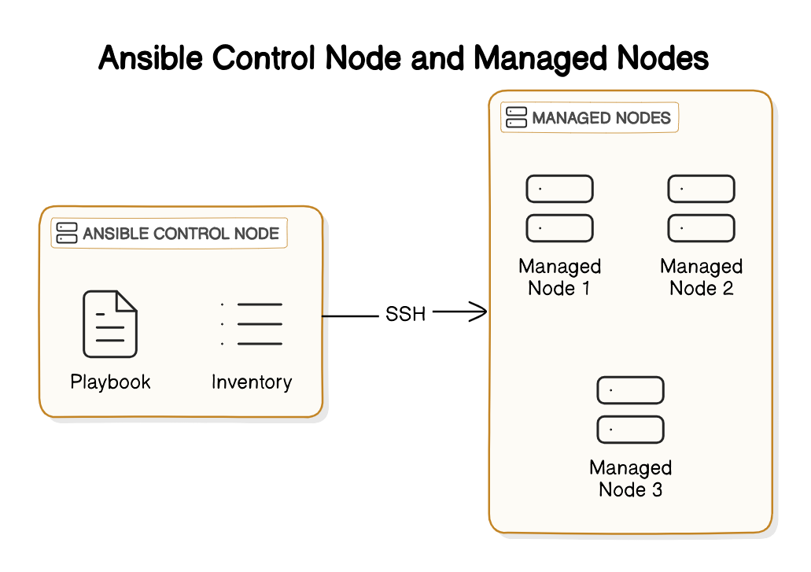

# Ansible
We can use Ansible for configuration management of slave servers. meaning install/deploy applications and configure provisioned infrastructure.

## Documentations
- [Official Documentation](https://docs.ansible.com/ansible/latest/getting_started/index.html)
- [SpaceLift Ansible Tutorial](https://spacelift.io/blog/ansible-tutorial)

## Ansible Concepts

- **Control node**

Any machine with Ansible installed. You can run commands and playbooks, invoking `/usr/bin/ansible` or `/usr/bin/ansible-playbook`, from any control node. You can use any computer that has Python installed on it as a control node - laptops, shared desktops, and servers can all run Ansible. However, you cannot use a Windows machine as a control node. You can have multiple control nodes.

- **Managed nodes**

The network devices (and/or servers) you manage with Ansible. Managed nodes are also sometimes called “hosts”. Ansible is not installed on managed nodes.

- **Inventory**

A list of managed nodes. An inventory file is also sometimes called a “hostfile”. Your inventory can specify information like IP address for each managed node. An inventory can also organize managed nodes, creating and nesting groups for easier scaling. To learn more about inventory, see [the Working with Inventory](https://docs.ansible.com/ansible/2.9/user_guide/intro_inventory.html#intro-inventory) section. In summary a File listing hosts and host groups to be managed.

- **Playbooks**

YAML files containing a series of tasks to be performed on hosts. Ansible is **Procedural** meaning we write the instructions on how to do tasks.

- **Inventory**

File listing hosts and host groups to be managed.

- **Modules**

Modules (also referred to as “task plugins” or “library plugins”) are discrete units of code that can be used from the command line or in a playbook task. Ansible executes each module, usually on the remote target node, and collects return values.

<div style="width:500px; margin: auto;">
  
</div>

## Workflow

- Make at least one machine a control node (control machine, master machine) which will connect to your slave servers (the servers you wish to manage).
- Inventory file is created from terraform results.
- set scaleway inventory vars ansible user : ansible
- create a new playbook to create ansible user with sudo permissions by overriding Var ansible user to root then disable ssh login root and password authentication in general.
- then other playbooks to manage servers, create users, install packages, etc.

## Setup Ansible configuration

### Verify your inventory.
```
$ ansible-inventory -i inventory.yml --list
```

### Tips for building inventories
- Ensure that group names are meaningful and unique. Group names are also case sensitive.
- Avoid spaces, hyphens, and preceding numbers (use floor_19, not 19th_floor) in group names.
- Group hosts in your inventory logically according to their What, Where, and When.

**What**
Group hosts according to the topology, for example: db, web, leaf, spine.

**Where**
Group hosts by geographic location, for example: datacenter, region, floor, building.

**When**
Group hosts by stage, for example: development, test, staging, production.

### Ansible Vault
Ansible Vault allows you to encrypt sensitive data, such as passwords, within your playbooks and variable files. Here's how you can use Ansible Vault to pass a password:

create/edit vault file
```bash
$ ansible-vault create vault.yml
$ ansible-vault edit vault.yml

# Add the following content
vault_control_node_user_password: "your_control_node_user_password"
```

### Initialize ansible environment
- Initialize ansible environment
```bash
$ ansible-playbook -i inventory.yml initialize.yml
```

### Ping the `scw_instances` in your inventory
```bash
$ ansible -i inventory.yml scw_instances -m ping
```

### Run your playbook
- Run a playbook
```bash
$ ansible-playbook -i inventory.yml setup_users.yml
```

### Run your playbook with vault
```bash
# it will ask for the vault password
$ ansible-playbook -i inventory.yml setup_users.yml --ask-vault-pass
```

### Master playbook
You can individually run playbooks or create a master playbook that includes all the playbooks you want to run at once.

- Create a master playbook that includes all the playbooks you want to run at once.
```bash
$ ansible-playbook -i inventory.yml initialize.yml
$ ansible-playbook -i inventory.yml master_playbook.yml --ask-vault-pass
```

## [Troubleshoting]
- Test the connection to the host
  ```bash
  $ ssh -i /home/alexon/.ssh/ansible-demo-user ansible@51.158.102.133 -v
  ```

- Remove the host from the known_hosts file : because the host key has changed
  **Host Key**
  A host key is a cryptographic key used by an SSH server to identify itself to clients. When you connect to an SSH server, the server presents its host key to the client, which the client can use to verify the server's identity. This helps ensure that you are connecting to the intended server and not to a malicious server pretending to be the intended one (a man-in-the-middle attack).

  Host keys are specific to a server and typically remain consistent unless the server is reinstalled, or the SSH server software is reconfigured. They are part of the SSH protocol's security measures.

  **known_hosts** File
  The known_hosts file is a file on the client's machine that stores the host keys of SSH servers the client has previously connected to. It acts as a record of trusted servers.

  ```bash
  $ ssh-keygen -f "/home/alexon/.ssh/known_hosts" -R "51.158.102.133"
  ```


## Alternatives IT Automation Tools

- Puppet :

Puppet Server is installed on Control Node. this control node holds the desired state configurations (also called "manifests") for all the managed nodes.

and Puppet Agent is installed in each Managed Nodes and Configure Puppet Agent to connect to Puppet Master (manually, using Ansible, Cloudinit)

- Chef

The Chef Server is the central hub in the Chef architecture. It stores all the configuration data (recipes, cookbooks, environments, roles, etc.) and serves as a repository for this information.

The Chef Client is installed on each managed node. The client periodically contacts the Chef Server to pull down configuration data (run-lists) and apply it to the node.

[Chef vs Puppet vs Ansible vs Saltstack | Configuration Management Tools](https://www.youtube.com/watch?v=_TVNCTK808I)


---